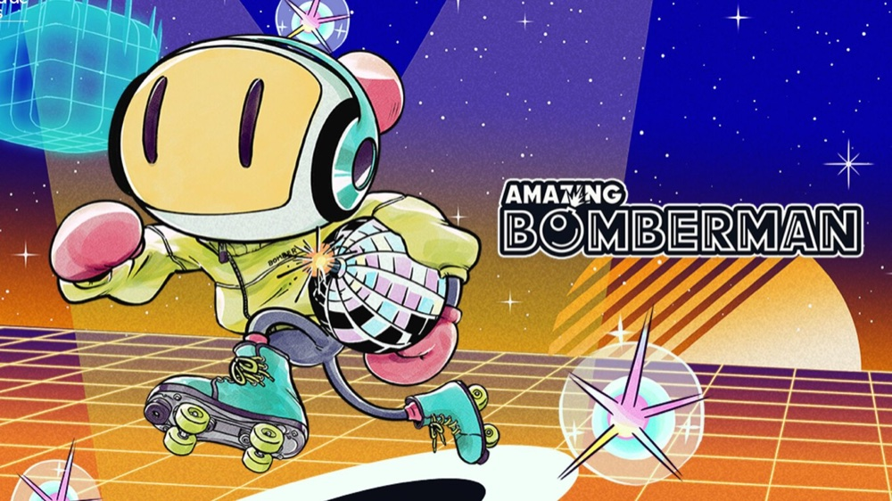

<div align="center">

# Bomberman TEC

Una versión del clásico **Bomberman** escrita en C con SDL2: destruye bloques,
vence a los enemigos y encuentra el portal antes de que se agote el tiempo.

[](source/BBMAN.c)
[](https://www.libsdl.org/)
[](Makefile)
[](LICENSE)



</div>

## Descripción

Bomberman TEC es un juego de escritorio desarrollado como proyecto del curso
**Diseño de Sistemas Digitales**. El jugador debe abrirse paso por escenarios
llenos de bloques destructibles, evitar explosiones y monstruos, recoger
mejoras y alcanzar el portal de salida.

El juego incluye tres niveles con ambientaciones diferentes, dificultad
progresiva, vidas, puntuación y un límite de tiempo.

## Características

- Tres niveles con escenarios de césped, lava y agua.
- Enemigos con movimiento automático y velocidad progresiva.
- Hasta cuatro bombas simultáneas mediante mejoras.
- Power-ups de velocidad, alcance de explosión y bomba adicional.
- Sistema de vidas, puntuación y cuenta regresiva.
- Modo ventana y pantalla completa.

## Inicio rápido

Necesitas un compilador de C, `make` y SDL2 con `sdl2-config` disponible en el
`PATH`.

```bash
git clone https://github.com/IPrometheusI/Bomberman_TEC.git
cd Bomberman_TEC
make Build
./salida
```

Si todavía no tienes las dependencias, el instalador interactivo detecta tu
sistema y muestra las opciones disponibles:

```bash
bash scripts/install_deps.sh
```

> [!IMPORTANT]
> Ejecuta el juego desde la raíz del repositorio para que pueda encontrar los
> recursos de la carpeta `assets/`.

Para iniciar en pantalla completa:

```bash
./salida -f
```

<details>
<summary><strong>Instalación manual de SDL2</strong></summary>

| Sistema | Comando |
| --- | --- |
| macOS | `brew install sdl2` |
| Ubuntu / Debian | `sudo apt install libsdl2-dev` |
| Fedora | `sudo dnf install SDL2-devel` |
| Arch Linux | `sudo pacman -S sdl2` |
| Windows | Instala SDL2 desde MSYS2 (MinGW64) o utiliza WSL. |

</details>

## Controles

| Tecla | Acción |
| :---: | --- |
| <kbd>↑</kbd> <kbd>↓</kbd> <kbd>←</kbd> <kbd>→</kbd> | Mover al jugador |
| <kbd>1</kbd> | Colocar la primera bomba |
| <kbd>2</kbd> <kbd>3</kbd> <kbd>4</kbd> | Colocar bombas adicionales después de obtener power-ups |
| <kbd>Espacio</kbd> | Iniciar la partida o volver al menú |
| <kbd>Esc</kbd> | Salir del juego |

## Comandos disponibles

| Comando | Descripción |
| --- | --- |
| `make` | Limpia, compila y ejecuta el juego. |
| `make Build` | Compila el ejecutable `salida`. |
| `make run` | Ejecuta una compilación existente. |
| `make build_run` | Limpia, compila y ejecuta. |
| `make clean` | Elimina el binario y los archivos temporales. |

## Estructura del proyecto

```text
Bomberman_TEC/
├── assets/               # Sprites, fondos y recursos gráficos
├── scripts/
│   └── install_deps.sh   # Instalador de dependencias por plataforma
├── source/
│   └── BBMAN.c           # Lógica, entrada y renderizado del juego
├── Makefile              # Compilación y ejecución
└── requirements.txt      # Dependencias del sistema
```

## Autores

- Maickol Fernández
- Jordi Pérez

## Licencia

Distribuido bajo la [licencia MIT](LICENSE).
